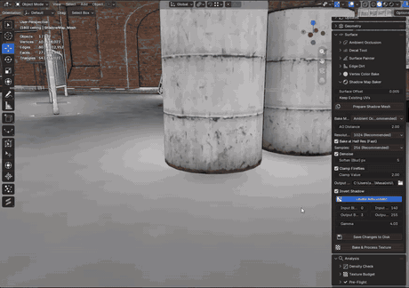
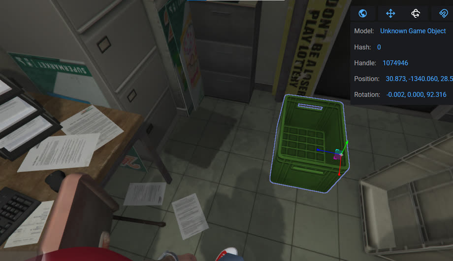

# Void Tools

One Blender add-on for GTA V / FiveM asset authoring, built on
[Sollumz](https://docs.sollumz.org). Almost every tool builds separate decal
geometry and never touches your original mesh; the analysis tools only read.
The exception is **Vertex Color Bake**, which writes `Color 1` onto the mesh you
select — baked vertex colour is mesh data, so there is nowhere else for it to
go.

📖 **[Documentation](https://seto3d.github.io/void-tools/)** — install, every
tool, troubleshooting. Built from [`docs/`](docs) in this repo.

> **The add-on is called Void Tools now** — it was *Seto Tools*, and the
> N-panel tab says the new name. Only the visible name changed: operators,
> per-object data and materials keep their old identifiers, so every existing
> `.blend` keeps its settings.

| Tool | What it makes | Built from |
| --- | --- | --- |
| [Ambient Occlusion](void_tools/fake_ao) | Ambient-occlusion corner decals | selected edges |
| [Edge Dirt](void_tools/edge_dirt) | The same strip, carrying a dirt texture you drop in a folder | selected edges |
| [Edge Wear](void_tools/fake_damage) | Chipped-edge damage decals | selected edges |
| [Decal Tool](void_tools/decal_tool) | Surface-aligned decal planes from your own decal library | selected faces |
| [Smooth Edge](void_tools/smooth_edge) | Normal-map strips that make a hard edge read as rounded | selected edges |
| [Surface Painter](void_tools/surface_painter) | Dirt, grime and graffiti brushed onto a surface | a paint mesh over the whole object |
| [Vertex Color Bake](void_tools/vertex_bake) | Procedural AO, dirt, grime and wear baked into `Color 1` — the one tool that writes to your mesh | the selected objects |
| [Shadow Map Baker](void_tools/shadow_map) | Bakes the room's own light into a texture and puts it back as a `decal_dirt` decal — AO, an aimed sun, or your own lights; levels adjusted live without re-baking | the selected surfaces |
| [Density Check](void_tools/density_checker) | A triangle-budget heatmap graded against vanilla GTA | the whole scene, read-only |
| [Texture Budget](void_tools/texture_budget) | The same heatmap for texture resolution, plus what the scene costs in VRAM | the whole scene, read-only |
| [Material Maker](void_tools/materials) | Height, normal and specular maps from one diffuse image | a diffuse texture |
| [Sign Glow](void_tools/sign_glow) | An emissive halo traced from 3D lettering, on a plane behind it — written out as a `.dds` and a Sollumz emissive shader | the selected lettering |
| [Pre-Flight](void_tools/preflight) | The export test you would otherwise run in game — missing UVs, unapplied scale, non-DDS textures | the whole scene, read-only |
| [Trash Scatter](void_tools/scatter) | Vanilla GTA litter scattered over a floor as MLO entities — dense along the walls, seeded, spaced — plus a procedural Floor Dirt overlay, the flat grime sheet vanilla interiors use | selected faces |

## What's new in 1.2.3

<!-- This section carries THIS release only. On the next one, replace it -
     the older clips stay on their own tool pages in the documentation, which
     is where somebody browsing the tools will look for them anyway.
     GIFs rather than links: GitHub strips <video> from Markdown and turns a
     linked .mp4 into a plain link nobody clicks, but it plays a GIF inline. -->



**Shadow Map Baker** — the light in a room, baked into a texture and put back
on a copy of the surface as a `decal_dirt` decal. That is how GTA's own
interiors have shadow at all: an MLO gets almost none in real time, so it is
painted into the asset first. Ambient occlusion needs no lights and reads as
contact shadow anywhere; a sun you aim by angle and altitude; or the lights you
placed yourself. Then **Levels** — invert, black and white points, gamma —
live, and without re-baking, so the expensive half happens once. Contributed by
[@cs-dev-09](https://github.com/cs-dev-09).

Denoise and Soften had never actually run: the compositor read its result from
`Render Result`, whose pixels Blender does not expose to Python, and the
failure went to a console Blender does not open. Anything that degrades a bake
now says so in the panel instead.

**Two things that broke updating are fixed.** The Update button could not
install any real update, because the release became an extension package and
the updater only knew the old add-on shape. And textures came back pink after
an update, because Blender records where an image came from as an absolute
path — every scene made with the bundled textures named the folder the add-on
happened to be installed in at the time.



**The full video plays in the [documentation](https://seto3d.github.io/void-tools/tools/shadow-map/)**
— the whole bake, start to finish. This is a six-second cut.

> **No prop library? Trash Scatter still works.** The add-on ships no GTA
> models — only their names and their measured sizes, which is what placement
> and export actually need. Without a library every prop lands as a wireframe
> box of the right size, in the right place, registered as the right MLO
> entity: **the export is identical and the game shows the real prop**, only
> your viewport shows boxes. To preview the real models, point
> **Preferences → Add-ons → Void Tools → Prop Library** at a folder of
> `.blend` files whose objects are named after archetypes (`prop_paper_ball`,
> `ng_proc_sodacan_01a`, …) and press **Rescan** once. Do not have one?
> **Recent Sollumz can build it** — *Sollumz Tools → Asset Library → Build
> Asset Library* turns your extracted game files into exactly this, and Void
> Tools reads the result as it is. See
> [the guide](https://seto3d.github.io/void-tools/tools/trash-scatter/#the-prop-library).

They all live in the **Void Tools** N-panel tab, each as its own collapsible
section, the way Sollumz Tools is laid out. The sections are grouped by what a
tool works on — the ones that build a strip along selected edges first, then
the ones that put texture on a surface, then the analysis that only reads —
and inside a section, everything you set once and stop thinking about is a
child panel, so the top of each one is the thing you actually came to press.

## Install

**From the extension repository** (Blender 4.2+, and it keeps itself updated).
In **Edit > Preferences > Get Extensions**, open the dropdown top-right →
**Repositories → + → Add Remote Repository**, and paste:

```
https://seto3d.github.io/void-tools/repo/index.json
```

Then search for **Void Tools** in Get Extensions and press Install. Blender
handles updates from there — and shows what the add-on is allowed to reach
before you install it.

**From a zip**, unchanged: grab `void-tools.zip` from the latest
[release](../../releases) (don't unzip), then **Edit > Preferences > Add-ons >
Install from Disk** → pick the zip → enable it → restart Blender.

Both artifacts ship on every release — an extension carries its manifest at the
archive root and Blender names the folder, where a classic add-on brings its
own folder, so one file cannot be both. **Install one, not both**: two copies
register the same panels and operators.

Requires Blender 4.2+ and Sollumz with its dependencies installed. Verified in
Blender 5.0.1 and 5.2.0 LTS.

**Updating** — from the repository, Blender does it and the tab's **Updates**
panel stands aside and says so. From a zip, that panel does it from inside
Blender: when a new release exists, its version appears on the panel header and
**Install Update** brings it in with your settings intact. The notification
comes from one version check per Blender start — it carries nothing about you,
it is the only network traffic in the add-on (the test suite enforces that),
and *Check for updates on startup* in the preferences turns it off.

> These used to be three separate add-ons (`seto_fake_ao`, `seto_fake_dmg`,
> `seto_decal_tool`). If you have any of them installed, **disable and remove
> them first** — they register the same operators and panels as this one.

## Layout

```
void_tools/
    __init__.py      registers the tools, in panel order
    shared/          code every tool uses
        sollumz_integration.py   every call into Sollumz, and the material builders
        vertex_color.py          the Color 1 they all write
        bundled_textures.py      finding a tool's own textures/ folder
        addon_prefs.py           the single AddonPreferences, reached from anywhere
    textures/        textures shipped with the add-on, per tool and category
    fake_ao/
    edge_dirt/       Ambient Occlusion's strip with its own texture and material
    fake_damage/
    decal_tool/
    smooth_edge/
    surface_painter/
    density_checker/ the read-only triangle-budget heatmap
    texture_budget/  the same, for texture resolution and VRAM
    preflight/       the read-only export checklist
    materials/       Material Maker - height/normal/specular from a diffuse
```

Blender allows exactly one `AddonPreferences` class per add-on, and that class
lives in `decal_tool/` for historical reasons. `shared/addon_prefs.py` is how
the others reach it, so no tool has to know where it ended up.

Each tool stays self-contained — its own settings, operators and panel, exactly
as when they shipped separately. `shared/` holds only what genuinely belongs to
all of them; `sollumz_integration.py` in particular used to be copy-pasted into
each one.

`edge_dirt/` is the deliberate exception: it builds the identical strip to
Ambient Occlusion and differs only in the texture on it, so it imports
`fake_ao/`'s geometry and live rebuild instead of carrying a second copy of
them. It owns what actually differs — its settings, its material, its bundled
texture and its panel.

Inside a tool the split is always the same:

| File | Holds |
| --- | --- |
| `geometry.py` | pure mesh maths — no Sollumz, no `bpy.data` |
| `properties.py` | Scene-level settings |
| `object_settings.py` | per-object settings that rebuild the result live |
| `operators.py` | the Create operator, tying it together |
| `ui.py` | the N-panel |

Surface Painter is the exception, because it is the one tool that is not
"select, press Create": it has no `geometry.py`, and its work lives in
`shell.py` (the paint mesh — building, masking, placement, optimising),
`library.py` (folder scanning, which knows nothing of `bpy.data`),
`previews.py` and `brush.py`. Density Check is the other: it builds nothing,
so it has no `object_settings.py` — its `geometry.py` is the budget maths and
its operators only read the scene.

## What they have in common

- **Select, press a button.** A separate decal object is created; the source
  mesh is never modified. Surface Painter reaches the same end differently — it
  spawns a paint mesh over the surface and you brush on that — but the promise
  is identical: delete what the tool made and the original is exactly as it was.
- **Sorted output.** Inside a Sollumz Drawable, what a tool generates lands in
  the Drawable's own collection, beside the rest of the asset. Outside one, each
  tool files into its own collection, created on first use: `fake_ao`,
  `edge_dirt`, `fake_dmg`, `smooth_edge`, and `decals` with one child per
  decal-library category.
- **Bundled textures, where they are small.** Ambient Occlusion, Edge Dirt, Edge
  Wear and Smooth Edge each ship their one texture in the tool's own `textures/` folder and
  wire it in automatically — drop a file there and it is picked up. The Decal
  Tool and Surface Painter instead read a library folder you point them at:
  their textures are whole sheets, they would be most of the download, and
  anyone doing this work already has a library of their own.
- **One vertex colour.** Every tool writes the same `Color 1`: RGB `#00B200`,
  alpha 1.0 at the centre of a strip fading to 0.0 at its outer edge. The alpha
  is what the decal shaders use as their blend factor; the RGB is not read by
  either `decal.sps` or `decal_normal_only.sps`, and is fixed so generated
  geometry is recognisable and consistent. It lives in
  [`shared/vertex_color.py`](void_tools/shared/vertex_color.py) — change it
  there and all four follow.
- **Shaded smooth.** Everything these tools generate is set smooth, so a strip
  shows no hard band at its quad boundaries. Applied to the generated object
  only, through the data API, so it survives a live rebuild too.
- **Upright UVs.** The strip tools fit their island into the 0..1 square standing
  vertically, so every generated strip unwraps the same way round.
- **Live settings.** What you generate remembers how it was made, so dragging a
  value in the **Selected …** section updates it as you drag — the feel of a
  Geometry Nodes modifier, except the result is real mesh data that needs no
  applying before export. The strip tools re-read their source edges; a decal
  carries the surface frame it was placed on, so it can even walk onto a
  neighbouring face when you slide it past an edge.
- **Straight UVs by construction.** UVs are laid out from the geometry in
  metres, then fitted into the 0..1 square with both axes scaled by the same
  factor. Nothing is solved, so an arc, a 90° turn and a straight run all give
  the same clean rectangle — no unwrap, no straightening afterwards. Decal Tool
  authors its quad UVs as a plain full 0–1 layout for the same reason.
- **Sollumz aware.** Correct `UVMap 0` / `Color 1` attributes, a real Sollumz
  shader material, and the strip parented into the Drawable hierarchy when the
  source belongs to one.

Each tool's own README has the details, and [CHANGELOG.md](CHANGELOG.md) has
what changed and why.

## Development

Verification scripts live in [`tests/`](tests). They drive a real Blender in
background mode against a real Sollumz install — there is no mocking — and cover
surface alignment under awkward transforms, the Sollumz attributes and shader
parameters, material reuse and separation, collection placement, failure cleanup
and a YDR export.

```bash
blender -b --python tests/verify_decal_tool.py
```

Every script exits non-zero on failure and prints a `RESULT: n/n` line. Run them
against each Blender you support: Sollumz's own API differs between versions, and
so does its exporter.

## Roadmap

Void Tools is in active development. What is coming, in order:

- **Leak / Grime Generator** — pick a start point and a gravity-following
  decal strip grows from it: water stains from a ceiling, rust runs under a
  pipe, damp along a wall–floor junction.
- **Floor Contact Dirt** — detect where props and walls meet the floor and lay
  contact dirt along the junction automatically.
- **Interior Dressing** — select an MLO shell, pick a preset (Warehouse,
  Restaurant, Hospital, …) and have fitting decals distributed over walls,
  floors, corners and ceilings, with seed, density and material filters. Ships
  one preset at a time.

Follow the [releases](../../releases) — each of these lands as its own version.

## Support

Void Tools is free and stays free. If it saves you time, you can support its
development through **GitHub Sponsors** — the button at the top of this repo,
or **Support > Become a Sponsor** at the foot of the N-panel tab.

Found something broken? **Support > Report a Bug** opens
[the issues](../../issues). A report with a .blend attached is worth more than
any of it.

## Thanks

Void Tools is built in the open, and it is better for the people who turn up.

**Contributors**

- [@cs-dev-09](https://github.com/cs-dev-09) — the **Vertex Colour** picker
  ([#1](../../pull/1)): every tool wrote one fixed green, and changing it by
  hand in Vertex Paint destroyed the alpha the decal shaders blend by. Now it
  is a preset list on the object, and the alpha cannot be touched by picking a
  colour.

  And **[Vertex Color Bake](void_tools/vertex_bake)** ([#2](../../pull/2)) —
  ambient occlusion, dirt, grime, wear, noise and a fake sun, stacked and baked
  straight into `Color 1`, with the raycasting cached so the sliders stay live.
  The cheapest wear in the add-on: no texture, no extra object, no draw call.
  It is also the only tool here that writes to the mesh you select, which is
  not a slip — baked vertex colour is mesh data and has nowhere else to live.

  And the **[Shadow Map Baker](void_tools/shadow_map)** ([#4](../../pull/4)) —
  the room's own light baked into a texture and put back as a `decal_dirt`
  decal, which is how an MLO gets shadow at all indoors. Ambient occlusion, a
  sun you aim, or the lights you placed yourself; the levels adjust live, so
  the bake is paid for once and the dialling-in afterwards is free.

- [@gecu3d](https://github.com/gecu3d) — **Material Maker**: height, normal and specular maps from a
  single diffuse image, written as a standalone add-on and folded in here.

- [Molo Modding](https://github.com/molossen) — **[Sign Glow](void_tools/sign_glow)**:
  the halo behind lit 3D lettering. It traces the letters' own silhouette,
  blurs it at two radii — a tight core and a wide bloom — and puts the result
  on an emissive plane just behind them, which is how a sign reads at night in
  game without a single real light being placed. Written as a standalone
  add-on and folded in here; the DDS writer it brought is now shared by the
  whole project, because nothing else here could put a texture on disk in a
  format GTA reads.

**Sponsors**

- [@Zydrec](https://github.com/Zydrec) — the first person to fund this work.

A tool that is free either way is not owed that, and it is noticed. Thank you.

Only sponsors who are public on
[the sponsors page](https://github.com/sponsors/seto3d) are listed here, and
anyone who would rather not be has only to say so on
[the issues](../../issues).
